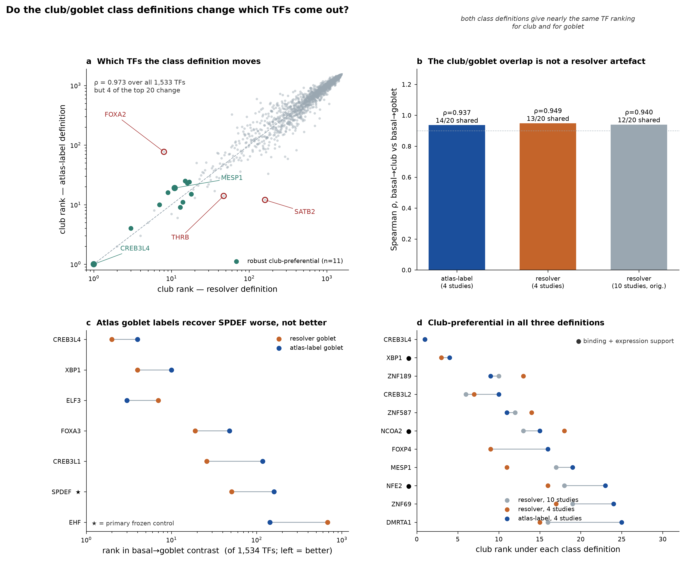

# Do the club/goblet class definitions change which TFs come out?

Run 2026-09-10. Driver: `scripts/run_atlas_label_arms.py`. Everything below is computed
from that run. The six regulon tables are reused verbatim from the prior-only run, so the
class definition is the only variable that moves.

## Why this run exists

The earlier run defined club and goblet with the marker-based secretory resolver; the HLCA
ships its own `ann_finest_level` labels for the same cells. Before spending compute we
measured how far the two definitions diverge, from the saved per-cell assignments:

| class | pooled Jaccard | resolver cells | atlas cells | cells in both |
|---|---|---|---|---|
| club | 0.360 | 9,880 | 10,395 | 5,372 |
| goblet | 0.103 | 1,714 | 5,282 | 654 |

858 atlas goblet cells are called club by the resolver; 681 atlas club cells are called
goblet. Per-study goblet Jaccard across the four analysed studies is 0.02-0.18. That is not
a cosmetic difference, so the re-run was justified rather than skipped.

## Design

Both arms use the same cells, donors, studies and networks. Basal and ciliated come from the
atlas label in *both* arms; only club and goblet differ. Studies are restricted to the four
with at least 100 cells in both classes (Banovich_Kropski_2020, Barbry_Leroy_2020, Nawijn_2021, Seibold_2020), so no difference
between arms can be attributed to study mix.

| arm | basal | club | goblet | ciliated | pseudobulk profiles |
|---|---|---|---|---|---|
| atlas_label | 77,807 | 10,186 | 4,107 | 25,765 | 149 |
| resolver | 77,807 | 8,482 | 1,478 | 25,765 | 146 |

## Result 1 — the ranking is robust, the top of it is not

Spearman ρ between arms over all shared TFs: **0.973** (basal→club), **0.953**
(basal→goblet), **1.000** (basal→ciliated). The ciliated contrast is the internal control —
that class is identical in both arms, so any deviation from 1.0 would have indicated a bug.

Four of the top 20 club drivers change: FOXA3, NCOA3, SATB2 and THRB enter under the atlas
labels; DMRTA1, FOXA2, NFE2 and ZNF69 drop out.

## Result 2 — FOXA2's club-specificity is definition-dependent

FOXA2 club rank: **5** (resolver, 10 studies), **8** (resolver, 4 studies), **77** (atlas
labels, 4 studies). It stays ranked above its own goblet contrast in all three, but it is a
top-10 club driver only under the resolver's club definition. The regulon figure in
`docs/qc_2026-09/` that features FOXA2 must carry this caveat: **FOXA2 is not a
definition-robust club candidate.**

## Result 3 — the club/goblet overlap is not a resolver artefact

Within-arm ρ between basal→club and basal→goblet activity:

| definition | ρ (club vs goblet) | top-20 shared |
|---|---|---|
| atlas-label, 4 studies | 0.937 | 14/20 |
| resolver, 4 studies | 0.949 | 13/20 |
| resolver, 10 studies | 0.940 | 12/20 |

Using the atlas's own labels does not separate the two secretory programs. The earlier
conclusion stands and is now definition-independent: at pseudobulk resolution against these
priors, basal→club and basal→goblet are close to the same contrast, and only the
club-preferential residual supports any claim of club specificity.

## Result 4 — the atlas goblet label recovers SPDEF *worse*

SPDEF rank in basal→goblet: **51** under the resolver's goblet definition, **160** under the
atlas's own goblet label. CREB3L1 (26 → 118), FOXA3 (19 → 48), XBP1 (4 → 10) and CREB3L4
(2 → 4) move the same way; only EHF improves (681 → 143). By the frozen positive-control
criterion the marker-based goblet class is the better-behaved of the two definitions — the
opposite of what "use the atlas's own labels" predicts. The likely cause is the divergence
already measured: a large fraction of atlas goblet cells score as club on the marker panels,
so the atlas goblet pseudobulk is a mixture.

Ciliated controls are identical between arms (FOXJ1 1, RFX3 3, RFX2 5, MYB 40, TP73 71,
E2F4 1523), as designed.

## Result 5 — definition-robust club-preferential set

Pre-specified rule: club rank ≤ 25 **and** ranked above its own goblet contrast, in all three
definitions. Eleven TFs qualify:

CREB3L4, XBP1, ZNF189, CREB3L2, ZNF587, NCOA2, FOXP4, MESP1, NFE2, ZNF69, DMRTA1.

Of these only **XBP1, NCOA2 and NFE2** carry both binding-derived and co-expression-derived
support; the other eight rest on three co-expression libraries. CREB3L4 and XBP1 are the two
strongest, and both are ER/secretory-stress factors expected in any secretory contrast — on
their own they are not evidence of club identity. Ranks for every club-top-20 factor that
failed the rule are in `tables/club_specificity_robustness.csv`: MITF, FOXA1, ELF3, HNF4G,
STAT1 and MECOM fail because they rank *higher* in goblet; SATB2 (12 → 160) and THRB
(14 → 47) because they collapse when the definition changes; SMAD4 on an exact tie (18/18).

## What this does not establish

The frozen acceptance gate still cannot pass: SPDEF and FOXJ1 have no ReMap/ENCODE/Literature
ChIP regulon in this network set, so two-family support is unavailable for them by
construction. Every ranking here remains provisional. The per-arm club-unique lists are:

- atlas_label: CREB3L2, ZNF587, THRB, FOXP4, FOXA3, MESP1
- resolver: FOXA2, MESP1, DMRTA1, NFE2, ZNF69, NCOA2, SMAD4

Only MESP1 appears in both — which is why the rank-based robustness rule above, not either
list on its own, is the defensible statement.
