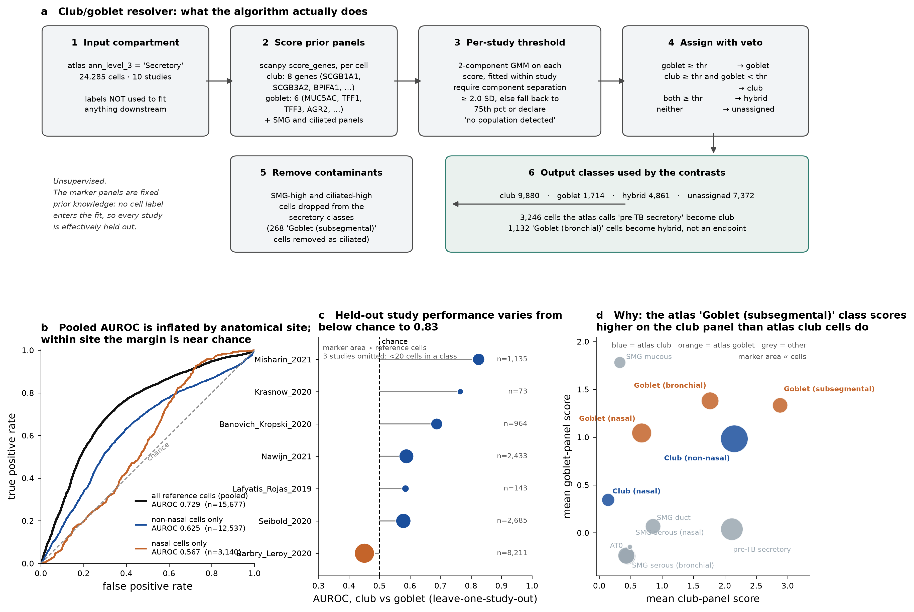
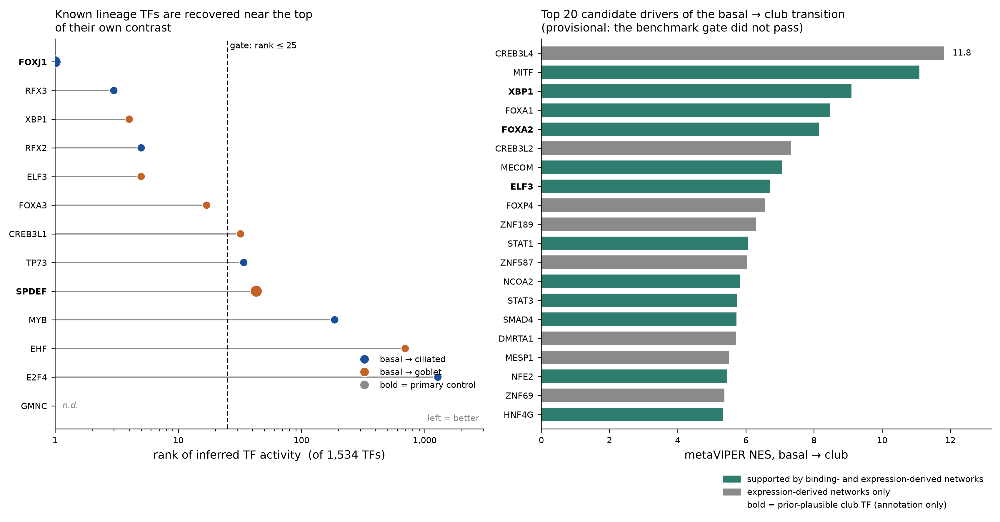
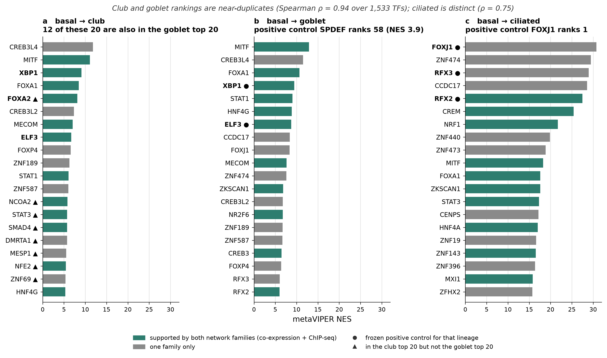
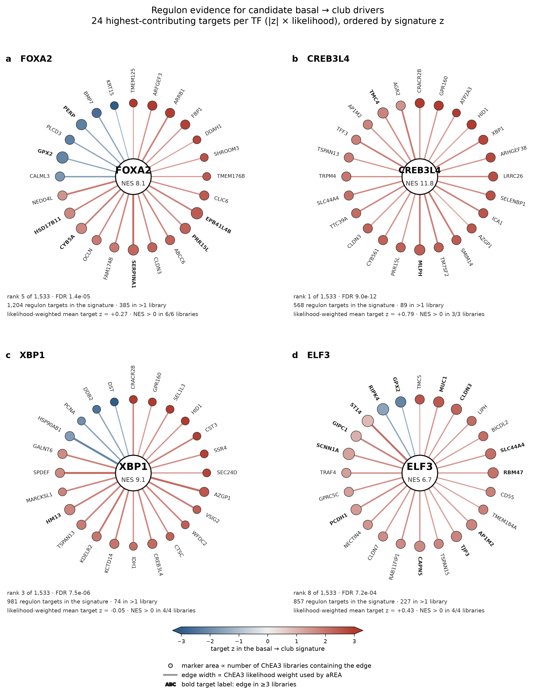

# QC report — HLCA prior-only run

Generated 2026-09-10. Every number here is computed from
`results/hlca_prior_only/` and `results/qc/`; nothing is projected or carried over from the design document.

## 1. What ran, on what

One dataset was ingested: the HLCA core reference (CELLxGENE dataset `066943a2-fdac-4b29-b348-40cede398e4e`,
Sikkema et al. 2023, doi:10.1038/s41591-023-02327-2), subset to healthy non-nasal-inclusive airway
epithelium. The four datasets in `config/datasets.yaml` marked `role: atlas` were **not** ingested, so
neither the scArches integration nor the ALI-trajectory arm of the design was exercised. The run therefore
enters the DAG below integration, with prior-derived regulons only and no ARACNe network.

| study (HLCA label) | donors basal | donors club | donors goblet | donors ciliated | secretory cells scored | atlas club ref cells | atlas goblet ref cells | club/goblet AUROC | used for |
|---|---|---|---|---|---|---|---|---|---|
| Barbry_Leroy_2020 | 9 | 10 | 4 | 9 | 9,972 | 7,095 | 1,116 | 0.451 | airway subset; secretory resolver; pseudobulk:basal; pseudobulk:club; pseudobulk:goblet; pseudobulk:ciliated; LOSO eval |
| Banovich_Kropski_2020 | 2 | 17 | 0 | 24 | 3,959 | 813 | 151 | 0.687 | airway subset; secretory resolver; pseudobulk:basal; pseudobulk:club; pseudobulk:ciliated; LOSO eval |
| Seibold_2020 | 14 | 6 | 6 | 13 | 3,189 | 496 | 2,189 | 0.578 | airway subset; secretory resolver; pseudobulk:basal; pseudobulk:club; pseudobulk:goblet; pseudobulk:ciliated; LOSO eval |
| Nawijn_2021 | 10 | 6 | 6 | 10 | 2,838 | 1,782 | 651 | 0.588 | airway subset; secretory resolver; pseudobulk:basal; pseudobulk:club; pseudobulk:goblet; pseudobulk:ciliated; LOSO eval |
| Misharin_2021 | 1 | 2 | 1 | 2 | 1,933 | 23 | 1,112 | 0.825 | airway subset; secretory resolver; pseudobulk:basal; pseudobulk:club; pseudobulk:goblet; pseudobulk:ciliated; LOSO eval |
| Krasnow_2020 | 3 | 3 | 1 | 3 | 1,506 | 51 | 22 | 0.765 | airway subset; secretory resolver; pseudobulk:basal; pseudobulk:club; pseudobulk:goblet; pseudobulk:ciliated; LOSO eval |
| Misharin_Budinger_2018 | 0 | 1 | 0 | 6 | 437 | 4 | 9 | — | airway subset; secretory resolver; pseudobulk:club; pseudobulk:ciliated; LOSO eval: too few ref cells |
| Lafyatis_Rojas_2019 | 0 | 1 | 0 | 5 | 314 | 122 | 21 | 0.585 | airway subset; secretory resolver; pseudobulk:club; pseudobulk:ciliated; LOSO eval |
| Teichmann_Meyer_2019 | 0 | 0 | 0 | 2 | 73 | 4 | 11 | — | airway subset; secretory resolver; pseudobulk:ciliated; LOSO eval: too few ref cells |
| Meyer_2019 | 0 | 0 | 0 | 2 | 64 | 5 | 0 | — | airway subset; secretory resolver; pseudobulk:ciliated; LOSO eval: too few ref cells |

Donor counts are per class per study; a donor contributing basal and club pseudobulk is counted in both
columns. Across the 10 studies: 39 donors contributed basal pseudobulk, 46 club, 18 goblet, 76 ciliated.
24,285 secretory cells entered the resolver.

### Datasets specified in the design but not used by this run

| dataset id | role in design | source | accession / dataset id | note |
|---|---|---|---|---|
| deprez_2020 | atlas | geo | GSE143868 | Positional series. airway_position is real biology and must enter the model as a covariate; nasal locations are flagged, never silently pooled with bronchial. |
| goldfarbmuren_2020 | atlas | geo | GSE134174 | — |
| ruizgarcia_2019 | atlas | geo | GSE121600 | Ground truth for both the differentiation trajectory (real ALI time, not pseudotime) and the club/goblet resolver. GSM3439925 (in vivo bronchial biopsy) is the designated resolver holdout. Media is a covariate with a mandatory per-medium sensitivity run: BEGM and PneumaCult give different secretory composition. |
| ravindra_2021 | atlas | cellxgene | GSE166766 | The genuinely bronchial ALI set. Mock/uninfected cells ONLY: infected cells carry an interferon program that will dominate any differential signature. The infection filter is asserted at load time, not left to a downstream subset. |
| hlca_core | reference | cellxgene | 066943a2-fdac-4b29-b348-40cede398e4e | scArches/scANVI label-transfer anchor. Never merged into the atlas as a batch. |

## 2. Club/goblet resolver

The resolver is **unsupervised**: marker panels are fixed prior knowledge and no cell label enters the fit,
so evaluating it against the atlas's own labels is a concordance test rather than a train/test split.

The frozen hold-out in `config/params.yaml` is `GSM3439925` (GSE121600), a sample from a dataset this run
never ingested. Rather than skip validation, performance was measured **leave-one-study-out** across the
atlas's contributing studies — thresholds refit on the remaining studies for each held-out one, scored
against the atlas's finest-level labels. This is a substitute for the designed validation, not the designed
validation, and the frozen requirement (balanced accuracy ≥ 0.85 on `GSM3439925`) remains unmet: it was not
met in any study here (best 0.742), and the designed sample was never tested.

| held-out study | atlas club cells | atlas goblet cells | AUROC | balanced accuracy | fraction decided |
|---|---|---|---|---|---|
| Misharin_2021 | 23 | 1,112 | 0.825 | 0.742 | 0.887 |
| Krasnow_2020 | 51 | 22 | 0.765 | 0.546 | 0.712 |
| Banovich_Kropski_2020 | 813 | 151 | 0.687 | 0.595 | 0.928 |
| Nawijn_2021 | 1,782 | 651 | 0.588 | 0.510 | 0.871 |
| Lafyatis_Rojas_2019 | 122 | 21 | 0.585 | 0.431 | 0.923 |
| Seibold_2020 | 496 | 2,189 | 0.578 | 0.556 | 0.539 |
| Barbry_Leroy_2020 | 7,095 | 1,116 | 0.451 | 0.624 | 0.933 |
| Meyer_2019 | 5 | 0 | — | — | — |
| Misharin_Budinger_2018 | 4 | 9 | — | — | — |
| Teichmann_Meyer_2019 | 4 | 11 | — | — | — |

Three studies are omitted for having fewer than 20 cells in one of the two classes.

**The pooled AUROC is inflated by anatomical site.** Pooled over all reference cells it is 0.729; restricted
to non-nasal cells it falls to 0.625, and within nasal cells to 0.567. Panel d gives the mechanism: the
atlas class `Goblet (subsegmental)` has a *higher* mean club-panel score (2.88) than the atlas's own
`Club (non-nasal)` cells (2.15), and `Club (nasal)` cells barely score on the club panel at all (0.15).
The club-minus-goblet margin is therefore close to uninformative within a site.

This is the single largest open defect in the pipeline. It means the `club` class fed to the contrast is a
mixture, and it explains the result in section 4.

## 3. Positive-control recovery

| contrast | TF | role | rank | percentile | NES | FDR |
|---|---|---|---|---|---|---|
| basal_to_goblet | SPDEF | primary | 58.000 | 3.781 | 3.928 | 0.024 |
| basal_to_goblet | FOXA3 | secondary | 22.000 | 1.434 | 5.847 | 0.002 |
| basal_to_goblet | CREB3L1 | secondary | 32.000 | 2.086 | 5.218 | 0.002 |
| basal_to_goblet | XBP1 | secondary | 4.000 | 0.261 | 9.445 | 0.000 |
| basal_to_goblet | ELF3 | secondary | 7.000 | 0.456 | 8.748 | 0.000 |
| basal_to_goblet | EHF | secondary | 695.000 | 45.306 | -1.973 | 0.303 |
| basal_to_goblet | CREB3L4 | secondary | 2.000 | 0.130 | 11.527 | 0.000 |
| basal_to_ciliated | FOXJ1 | primary | 1.000 | 0.065 | 30.753 | 0.000 |
| basal_to_ciliated | RFX2 | secondary | 5.000 | 0.326 | 27.492 | 0.000 |
| basal_to_ciliated | RFX3 | secondary | 3.000 | 0.196 | 28.959 | 0.000 |
| basal_to_ciliated | TP73 | secondary | 70.000 | 4.563 | 10.773 | 0.000 |
| basal_to_ciliated | MYB | secondary | 38.000 | 2.477 | 13.009 | 0.000 |
| basal_to_ciliated | E2F4 | secondary | 1523.000 | 99.283 | -17.377 | 0.000 |
| basal_to_ciliated | GMNC | secondary | — | — | — | — |

FOXJ1 is rank 1 of 1,533 in its own contrast with RFX3 at 3 and RFX2 at 5 — the ciliated arm behaves as the
design predicted. SPDEF is rank 58 (top 3.8%) in the goblet contrast, above the "higher, not necessarily
top" bar but outside the frozen absolute ceiling. E2F4 and EHF fall at the wrong end, and GMNC has no
regulon in any library. The frozen gate additionally requires confirmation from both network families for
the primary controls, which is unmeetable: neither SPDEF nor FOXJ1 has a regulon in any of the three
binding-derived libraries. **The gate does not pass, so every club prediction below is provisional.**

## 4. Three-lineage driver comparison

| contrast pair | Spearman ρ | top-20 overlap | TFs compared |
|---|---|---|---|
| basal_to_club vs basal_to_goblet | 0.936 | 12 | 1,533 |
| basal_to_club vs basal_to_ciliated | 0.754 | 3 | 1,533 |
| basal_to_goblet vs basal_to_ciliated | 0.763 | 8 | 1,533 |

The club and goblet rankings are near-duplicates: Spearman ρ = 0.94 over all 1,533 scored TFs, with 12 of
the top 20 shared (CREB3L4, MITF, XBP1, FOXA1, CREB3L2, MECOM, ELF3, FOXP4, ZNF189, STAT1, ZNF587, HNF4G).
The ciliated contrast is genuinely distinct (ρ = 0.75, 3 of 20 shared) and recovers its control at rank 1.

Read together with section 2, the most defensible interpretation is that this run has identified a
**shared secretory-differentiation TF program**, not a club-specific one. Eight TFs are in the club top 20
but not the goblet top 20 — FOXA2 (rank 5), NCOA2, STAT3, SMAD4, DMRTA1, MESP1, NFE2, ZNF69 — and those are
the only entries for which club specificity is even arguable on this evidence.

## 5. Regulon evidence for candidate drivers

Wheels show the 24 targets contributing most to each TF's enrichment score (|z| × ChEA3 likelihood), ordered
by their z in the basal → club signature. Two caveats matter for interpretation:

- ChEA3 edges are **unsigned**. aREA tests for coordinate displacement of the regulon, so a positive NES
  means the targets move together, not that the TF activates them. XBP1 illustrates the consequence: NES
  +9.1 with a likelihood-weighted mean target z of −0.05.
- Support is uneven across libraries. FOXA2's regulon appears in all 6 libraries with 385 of its 1,204
  signature-overlapping targets in more than one; CREB3L4's appears in 3.

FOXA2's wheel is the cleanest of the four: club-associated secretory targets (SERPINA1, CLDN3, PRR15L,
EPB41L4B, CYB5A, HSD17B11) up, basal/squamous targets (KRT15, BMP7, GPX2, PERP) down, which is the expected
direction for a basal → club transition and is not an artefact of unsigned edges.

## 6. What would close the gaps

1. Ingest GSE121600 and run the designed hold-out on `GSM3439925`, so the frozen balanced-accuracy
   requirement is testable at all.
2. Replace the marker-score margin with a site-aware classifier, or stratify the resolver by
   `airway_position` — the current pooled AUROC does not survive within-site stratification.
3. Build an ARACNe network on the aggregated atlas so the two-family gate criterion is satisfiable for
   SPDEF and FOXJ1, which have no binding-derived regulon.
4. Add a second signature construction (trajectory-based, not endpoint contrast) so candidates can reach
   the top confidence tier, which requires agreement across constructions.
